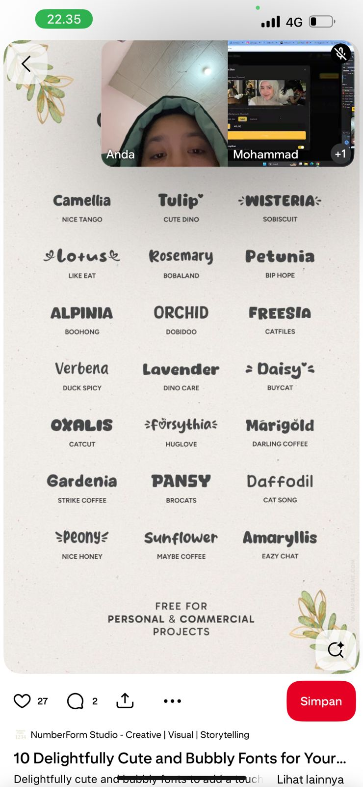
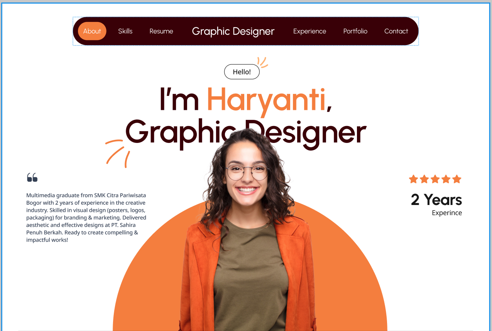
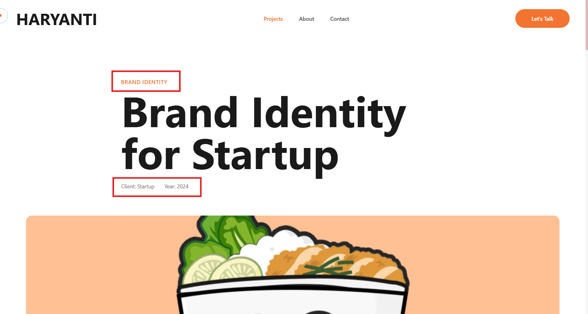
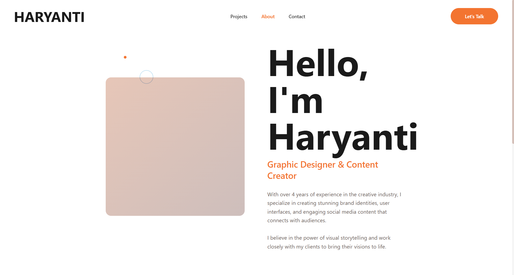

Perubahan ini akan saya jelaskan dengan sangat detail tetapi jika ada yang ingin ditanyakan silahkan. Dan kalo bisa tanyakan lebih detail lagi. Agar konteks yang nanti saya berikan jelas dan mudah dipahami. Dan juga kita akan membuat plan untuk melakukan beberapa perubahan ini. Karena ini perubahan yang cukup besar dan kompleks. Sebaiknya kita membuat plan untuk satu per satu revisi nya.

# List Perubahan Client
1. Perubahan font family pada seluruh halaman di Frontend Portfolio (CMS Tidak Perlu diubah). Ini referensi yang diberikan oleh client  Client ingin menggunakan font dengan gaya yang fun tapi tidak terlalu berlebihan jadi fun tapi semi formal. Dari font yang ada digambar yang mana yang menurut anda paling cocok?

2. Perubahan layout halaman utama pada bagian hero section. Ini perubahan yang menurut saya lumayan berimpact kepada perubahan UI dan Juga harus ada strategi untuk menangani performa website untuk perubahan ini. Ini layout yang di inginkan oleh client  [Link Figma](https://www.figma.com/design/M7FM9sg99UQ1QV8Ic03p52/Portfolio-Haryanti?node-id=5204-940&t=iq7waueOyJUpHAKX-0). Saya ingin menangani perubahan ini dengan tambahan pada CMS, jadi layout untuk Panel Horizontal Scrolling pada Hero Section ini kita buat menjadi template yang bisa di pilih di CMS. Namun, data yang kita simpan itu masih sama dengan yang sebelumnya. Hanya saja user bisa memilih template horizontal scrolling pada hero section ini. Rencana nya untuk saat ini saya ingin ada 2 template terlebih dahulu yaitu layout yang sekarang dan layout yang di inginkan oleh client. Oh iya untuk navigasi itu hanya berubah bentuk nya saat floating saja. Dan itu tidak perlu melihat template karena itu perubahan fixed yang diinginkan oleh client.

3. Perubahan logika bisnis dan flow pada project module client ingin Project Module ini diubah menjadi Portfolio Module. Dia ingin portfolio ini dibagi kedalam 1 tempat kerja atau 1 client dengan didalam nya terdapat beberapa portfolio gallery. Contoh:
- Hotel ABC
    - Kategori 1
        - Portfolio Gallery 1
        - Portfolio Gallery 2
    - Kategori 2
        - Portfolio Gallery 3
        - Portfolio Gallery 4
- Cafe AAA
    - Kategori 1
        - Portfolio Gallery 1
        - Portfolio Gallery 2
    - Kategori 2
        - Portfolio Gallery 3
        - Portfolio Gallery 4
Sedangkan yang nanti nya di showcase pada halaman utama dan halaman portfolio itu adalah di level terluar yaitu Hotel ABC, Cafe AAA, Creative Agency BAC, dll. Untuk gambaran besar nya seperti itu. JIka anda masih belum paham dan kurang spesifik tanyakan saya nanti ketika review.

4. Perubahan layout halaman detail project (yang nantinya akan diubah menjadi detail portfolio) ingin menghilangkan bagian bagian ini  kemudian klien juga ingin dekripsi serta The Problem, The Solution, dan The Result ingin dihilangkan juga.

5. Selain itu, masih dihalaman detail project (yang nantinya akan diubah menjadi detail portfolio) pada bagian "Portfolio Gallery" layoutnya ingin menjadi "Mansory Gallery" seperti pada pinterest dengan tampilan yang modern.

6. Perubahan section Skiils & Expertise untuk bagian Hard Skill dan Soft Skill. Perubahan di hard skill seperti rule seperti ini:
- Icon ingin bisa dicustom dengan upload
- Background tetap ada dan bisa diatur solid dan gradient
- Shape nya ingin berbentuk kubus
Sedangkan, Soft Skill seperti ini:
- Icon bisa diupload
- Deskripsi dihapus, tidak perlu ada deskripsi untuk soft skill.

7. Module Services untuk sementara di hide, jangan dihapus!

8. Pada bagian Section Experience, ukuran font untuk role nya lebih diperkecil. Jangan terlalu besar. Kemudian, client juga meminta bisa mengatur background di masing masing panel atau masing masing experience.

9. Tambahan floating Whatsapp, nomor whatsapp nya minta bisa diatur di CMS.

10. Pada footer di bagian CONNECT, spotify diubah saja dengan pinterest baik di frontend portfolio dan cms

11. Pada Judul section Portfolio, Skill & Expertise, dan CTA ingin diberikan dekorasi seperti pada gambar ini yang saya berikan kotak merah . Begitupun juga pada halaman about dan portfolio.

12. Untuk image pada halaman ini  dan Hero Section dia ingin nanti akan memasukkan gambar diri nya tanpa background atau png kemudia tampilan diweb nya ingin ada efek dia keluar dari background sesuai dengan pallete warna yang ditentukan lewat CMS

13. Module Education juga ingin sementara di hide jangan di hapus!