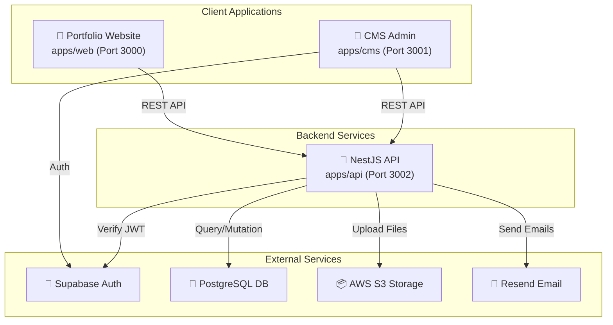
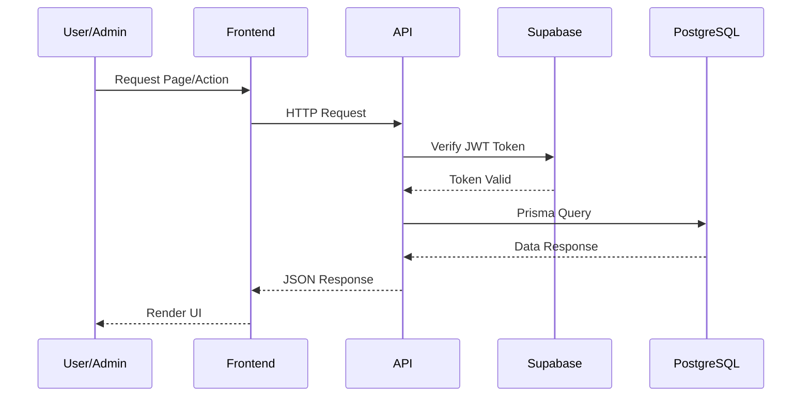
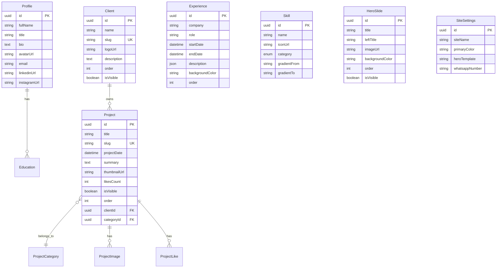
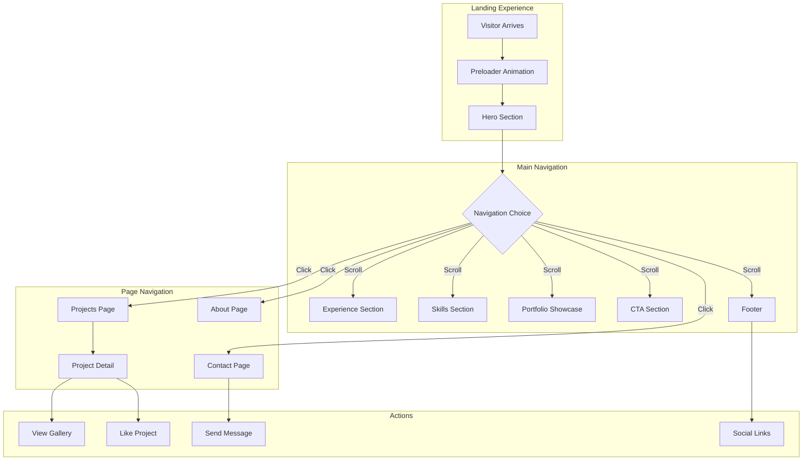
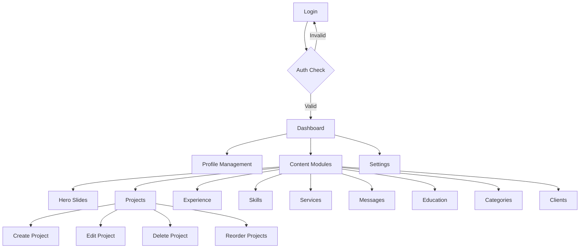
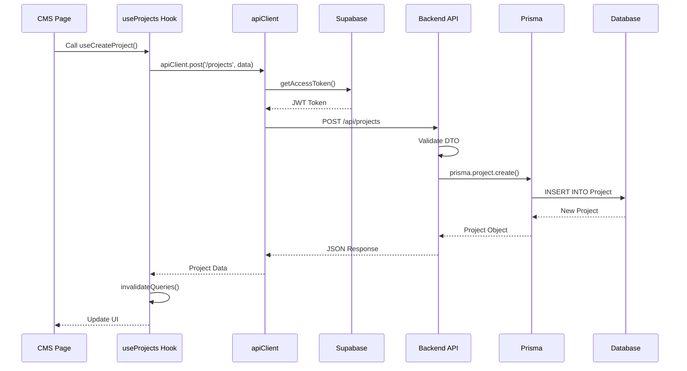

# 📚 Dokumentasi Lengkap: Portofolio Haryanti

> **Versi**: 0.1.0  
> **Last Updated**: 11 Januari 2026  
> **Status**: Dalam Pengembangan

---

## 📖 Daftar Isi

1. [Latar Belakang & Tujuan](#latar-belakang--tujuan)
2. [Tech Stack](#tech-stack)
3. [Arsitektur Sistem](#arsitektur-sistem)
4. [Design Pattern](#design-pattern)
5. [Database Schema](#database-schema)
6. [Flow Navigasi & Pengunjung](#flow-navigasi--pengunjung)
7. [Code Flow & Struktur](#code-flow--struktur)
8. [Strategi Optimasi & Performa](#strategi-optimasi--performa)
9. [Testing & Quality Assurance](#testing--quality-assurance)
10. [Analisa Progress](#analisa-progress)
11. [Kelebihan & Kekurangan](#kelebihan--kekurangan)
12. [Peluang Pengembangan](#peluang-pengembangan)
13. [Cara Menjalankan Project](#cara-menjalankan-project)

---

## 🎯 Latar Belakang & Tujuan

### Latar Belakang
Proyek ini adalah website portfolio profesional untuk seorang **Graphic Designer & Content Creator** bernama Haryanti. Dibangun sebagai solusi modern yang memungkinkan pengelolaan konten secara dinamis melalui CMS, tanpa perlu mengubah kode secara langsung.

### Tujuan Utama
1. **Showcase Portfolio** - Menampilkan karya-karya desain grafis dengan tampilan yang menarik
2. **Professional Branding** - Membangun personal brand yang kuat dan premium
3. **Content Management** - Mempermudah pengelolaan konten melalui CMS admin
4. **Performance First** - Website yang cepat dan responsif
5. **SEO Optimized** - Mudah ditemukan di mesin pencari

### Target Audiens
- Potential clients yang mencari graphic designer
- Recruiters dan HR perusahaan kreatif
- Kolega di industri kreatif

---

## 🛠 Tech Stack

### Monorepo & Build Tools
| Technology | Version | Purpose |
|------------|---------|---------|
| **Turborepo** | ^2.7.1 | Monorepo management & build orchestration |
| **pnpm** | 9.0.0 | Fast, disk space efficient package manager |
| **TypeScript** | 5.9.x | Type safety across all packages |

### Frontend - Portfolio Website (`apps/web`)
| Technology | Version | Purpose |
|------------|---------|---------|
| **React** | ^19.2.0 | UI component library |
| **Vite** | ^7.2.4 | Build tool & dev server |
| **TailwindCSS** | ^3.4.17 | Utility-first CSS framework |
| **GSAP** | ^3.12.5 | Advanced animations |
| **Lenis** | ^1.1.18 | Smooth scroll experience |
| **TanStack Query** | ^5.62.0 | Server state management |
| **React Router** | ^7.1.1 | Client-side routing |
| **React Helmet Async** | ^2.0.5 | Dynamic SEO meta tags |
| **Lucide React** | ^0.562.0 | Icon library |

### Frontend - CMS Admin (`apps/cms`)
| Technology | Version | Purpose |
|------------|---------|---------|
| **React** | ^19.2.0 | UI component library |
| **Vite** | ^7.2.4 | Build tool & dev server |
| **TailwindCSS** | ^3.4.17 | Utility-first CSS framework |
| **Supabase JS** | ^2.47.10 | Authentication |
| **TanStack Query** | ^5.62.0 | Server state & caching |
| **TanStack Table** | ^8.20.6 | Data tables |
| **React Hook Form** | ^7.54.2 | Form management |
| **Zod** | ^3.24.1 | Schema validation |
| **React Easy Crop** | ^5.5.6 | Image cropping |

### Backend API (`apps/api`)
| Technology | Version | Purpose |
|------------|---------|---------|
| **NestJS** | ^11.0.1 | Progressive Node.js framework |
| **Prisma** | ^6.1.0 | ORM & database toolkit |
| **Supabase** | ^2.47.12 | Auth verification |
| **AWS S3** | ^3.717.0 | File storage |
| **Helmet** | ^8.0.0 | Security headers |
| **Resend** | ^4.0.1 | Email service |
| **class-validator** | ^0.14.1 | DTO validation |

### Database & Shared Packages
| Package | Purpose |
|---------|---------|
| `@repo/database` | Prisma schema & client |
| `@repo/ts-types` | Shared Zod schemas & TypeScript types |
| `@repo/ui` | Shared React UI components |
| `@repo/eslint-config` | ESLint configurations |
| `@repo/typescript-config` | TypeScript configurations |

---

## 🏗 Arsitektur Sistem

### High-Level Architecture



### Monorepo Structure

```
portofolio-haryanti/
├── apps/
│   ├── web/          # Portfolio frontend (Vite + React)
│   ├── cms/          # Admin CMS (Vite + React)
│   └── api/          # Backend API (NestJS)
├── packages/
│   ├── database/     # Prisma schema & client
│   ├── ts-types/     # Shared Zod schemas
│   ├── ui/           # Shared UI components
│   ├── eslint-config/
│   └── typescript-config/
├── turbo.json        # Turborepo configuration
├── pnpm-workspace.yaml
└── package.json      # Root package.json
```

### Request Flow Diagram



---

## 🎨 Design Pattern

### 1. **Repository Pattern** (Backend)
NestJS modules mengikuti struktur clean architecture:
```
modules/<feature>/
├── <feature>.module.ts     # NestJS Module definition
├── <feature>.controller.ts # HTTP handlers
├── <feature>.service.ts    # Business logic
└── dto/                    # Data Transfer Objects
```

### 2. **Custom Hooks Pattern** (Frontend)
React Query wrapped dalam custom hooks untuk reusability:
```typescript
// Contoh: useProjects.ts
export function useProjects() {
    return useQuery({
        queryKey: projectKeys.visible(),
        queryFn: () => api.get<Project[]>('/projects/visible'),
        staleTime: 5 * 60 * 1000,
    });
}
```

### 3. **Component Composition Pattern**
```
components/
├── layout/          # Header, Footer, Layout wrapper
├── sections/        # Page sections (Hero, Experience, etc.)
├── shared/          # Reusable components (Preloader, Cursor)
└── ui/              # Atomic UI components
```

### 4. **Context Provider Pattern** (CMS)
```typescript
// Multiple context providers untuk state global
<ToastProvider>
    <OfflineProvider>
        <AuthProvider>
            {children}
        </AuthProvider>
    </OfflineProvider>
</ToastProvider>
```

### 5. **Golden Ratio Design System**
Sistem desain menggunakan rasio emas (1.618) untuk konsistensi visual:
```javascript
fontSize: {
    'xs': '0.625rem',   // 10px
    'sm': '0.875rem',   // 14px
    'base': '1rem',     // 16px
    'lg': '1.625rem',   // 26px (16 × 1.618)
    'xl': '2.625rem',   // 42px (26 × 1.618)
    '2xl': '4.25rem',   // 68px
    '3xl': '6.875rem',  // 110px
}
```

---

## 💾 Database Schema

### Entity Relationship Diagram



### Model Summary (14 Models)

| Model | Deskripsi |
|-------|-----------|
| `Admin` | Akun admin CMS (email) |
| `Profile` | Profil pengguna (bio, social links) |
| `Education` | Riwayat pendidikan |
| `Client` | Klien/tempat kerja (grouping Projects) |
| `Project` | Portfolio project/karya |
| `ProjectImage` | Galeri gambar project |
| `ProjectLike` | Like system berdasarkan IP |
| `ProjectCategory` | Kategori project |
| `Experience` | Pengalaman kerja |
| `Skill` | Hard/Soft skills |
| `Service` | Layanan yang ditawarkan |
| `Message` | Pesan dari pengunjung |
| `HeroSlide` | Slide carousel hero section |
| `SiteSettings` | Pengaturan global website |

---

## 🧭 Flow Navigasi & Pengunjung

### Portfolio Website User Flow



### CMS Admin Flow



### Pages & Routes

#### Portfolio Website (`apps/web`)
| Route | Page | Deskripsi |
|-------|------|-----------|
| `/` | Home | Landing page dengan semua section |
| `/projects` | Projects | Grid semua portfolio project |
| `/projects/:slug` | ProjectDetail | Detail project individual |
| `/about` | About | Halaman tentang diri |
| `/contact` | Contact | Form kontak |

#### CMS Admin (`apps/cms`)
| Route | Page | Akses |
|-------|------|-------|
| `/login` | Login | Public |
| `/` | Dashboard | Protected |
| `/profile` | Profile | Protected |
| `/hero-slides` | Hero Slides | Protected |
| `/projects` | Projects List | Protected |
| `/projects/new` | Create Project | Protected |
| `/projects/:id` | Edit Project | Protected |
| `/experience` | Experience List | Protected |
| `/skills` | Skills | Protected |
| `/services` | Services | Protected |
| `/messages` | Messages | Protected |
| `/settings` | Site Settings | Protected |
| `/categories` | Categories | Protected |
| `/clients` | Clients | Protected |
| `/education` | Education | Protected |

---

## 📂 Code Flow & Struktur

### Frontend Web Structure

```
apps/web/src/
├── main.tsx              # Entry point
├── App.tsx               # Root component + routing + Lenis setup
├── index.css             # Global styles
├── components/
│   ├── layout/
│   │   ├── Layout.tsx       # Main layout wrapper
│   │   ├── Header.tsx       # Navigation header
│   │   ├── Footer.tsx       # Footer component
│   │   ├── Navbar.tsx       # Navigation bar
│   │   └── CustomCursor.tsx # Custom cursor effect
│   ├── sections/
│   │   ├── Hero/            # Hero section (HeroSlides, HeroModern)
│   │   ├── Experience/      # Experience section
│   │   ├── Skills/          # Skills section
│   │   ├── Services/        # Services section
│   │   ├── Showcase/        # Portfolio showcase
│   │   └── ContactCTA/      # Call-to-action section
│   └── shared/
│       └── Preloader.tsx    # Loading animation
├── hooks/
│   ├── useProjects.ts      # Project fetching hooks
│   ├── useProfile.ts       # Profile hook
│   ├── useExperiences.ts   # Experience hook
│   ├── useSkills.ts        # Skills hook
│   ├── useHeroSlides.ts    # Hero slides hook
│   ├── useSettings.ts      # Site settings hook
│   └── useCategories.ts    # Categories hook
├── pages/
│   ├── Home.tsx
│   ├── Projects.tsx
│   ├── ProjectDetail.tsx
│   ├── About.tsx
│   └── Contact.tsx
└── lib/
    └── api.ts             # API client wrapper
```

### Frontend CMS Structure

```
apps/cms/src/
├── main.tsx
├── App.tsx               # Routing + Providers
├── context/
│   ├── AuthContext.tsx      # Authentication state
│   ├── ToastContext.tsx     # Toast notifications
│   └── OfflineContext.tsx   # Offline detection
├── components/
│   ├── layout/
│   │   └── DashboardLayout.tsx  # Admin layout
│   └── ...
├── hooks/
│   ├── useProjects.ts       # CRUD for projects
│   ├── useCategories.ts     # CRUD for categories
│   ├── useClients.ts        # CRUD for clients
│   ├── useExperiences.ts    # CRUD for experiences
│   ├── useSkills.ts         # CRUD for skills
│   ├── useServices.ts       # CRUD for services
│   ├── useHeroSlides.ts     # CRUD for hero slides
│   ├── useMessages.ts       # Messages management
│   ├── useProfile.ts        # Profile management
│   ├── useSettings.ts       # Site settings
│   ├── useEducations.ts     # Education CRUD
│   ├── useUpload.ts         # File upload
│   └── useDashboard.ts      # Dashboard stats
├── pages/
│   ├── Login.tsx
│   ├── Dashboard.tsx
│   ├── Profile.tsx
│   ├── Projects.tsx
│   ├── ProjectEdit.tsx
│   ├── Skills.tsx
│   └── ... (15 pages total)
└── lib/
    ├── apiClient.ts         # API client with auth
    ├── supabase.ts          # Supabase client
    └── queryClient.ts       # React Query setup
```

### Backend API Structure

```
apps/api/src/
├── main.ts               # NestJS bootstrap
├── app.module.ts         # Root module
├── config/
│   └── app.config.ts     # Configuration
├── common/
│   ├── guards/
│   │   └── supabase-auth.guard.ts
│   └── decorators/
├── modules/
│   ├── health/           # Health check endpoint
│   ├── auth/             # Authentication
│   ├── dashboard/        # Dashboard stats
│   ├── profile/          # Profile CRUD
│   ├── projects/         # Projects CRUD
│   ├── categories/       # Categories CRUD
│   ├── clients/          # Clients CRUD
│   ├── experiences/      # Experiences CRUD
│   ├── skills/           # Skills CRUD
│   ├── services/         # Services CRUD
│   ├── hero-slides/      # Hero slides CRUD
│   ├── settings/         # Site settings
│   ├── messages/         # Contact messages
│   ├── email/            # Email service
│   └── upload/           # File upload to S3
```

### Data Flow Example



---

## ⚡ Strategi Optimasi & Performa

### 1. Build & Development Optimization

| Strategy | Implementation |
|----------|---------------|
| **Turborepo Caching** | Build artifacts cached, incremental builds |
| **Parallel Execution** | Tasks run in parallel when no dependencies |
| **Package Hoisting** | pnpm efficient node_modules structure |

### 2. Frontend Performance

| Strategy | Implementation |
|----------|---------------|
| **Code Splitting** | Vite automatic chunk splitting |
| **Lazy Loading** | React.lazy for route components (recommended) |
| **Image Optimization** | External images from S3 CDN |
| **Smooth Scroll** | Lenis for 60fps scroll experience |
| **React Query Caching** | 5 minute staleTime, intelligent refetching |

```typescript
// React Query Configuration
const queryClient = new QueryClient({
  defaultOptions: {
    queries: {
      staleTime: 1000 * 60 * 5, // 5 minutes
      refetchOnWindowFocus: false,
    },
  },
});
```

### 3. Backend Performance

| Strategy | Implementation |
|----------|---------------|
| **Rate Limiting** | ThrottlerModule (100 req/min) |
| **Validation** | Global ValidationPipe |
| **Security Headers** | Helmet middleware |
| **Connection Pooling** | Prisma connection pool |

### 4. Animation Performance

| Strategy | Implementation |
|----------|---------------|
| **GSAP** | Hardware-accelerated animations |
| **will-change** | CSS optimization hints |
| **RequestAnimationFrame** | Lenis uses RAF for smooth scroll |

```typescript
// Lenis smooth scroll setup
const lenis = new Lenis({
    duration: 1.2,
    easing: (t) => Math.min(1, 1.001 - Math.pow(2, -10 * t)),
    smoothWheel: true,
});
```

---

## 🧪 Testing & Quality Assurance

### Testing Stack

| Type | Tool | Location |
|------|------|----------|
| **Unit Tests** | Vitest | `apps/web`, `apps/cms` |
| **E2E Tests** | Playwright | `apps/web/e2e`, `apps/cms/e2e` |
| **API Tests** | Jest | `apps/api` |

### Test Coverage

#### Web E2E Tests (`apps/web/e2e/`)
- `landing.spec.ts` - Landing page functionality
- `responsive.spec.ts` - Responsive design tests

#### CMS E2E Tests (`apps/cms/e2e/`)
- `auth.spec.ts` - Authentication flow
- `experience.spec.ts` - Experience CRUD
- `messages.spec.ts` - Messages management
- `skills.spec.ts` - Skills CRUD

### Running Tests

```bash
# Unit tests
pnpm test

# E2E tests
pnpm test:e2e

# Test specific app
pnpm --filter web test:run
pnpm --filter cms test:e2e
```

---

## 📊 Analisa Progress

### ✅ Completed Features

| Module | Status | Notes |
|--------|--------|-------|
| Monorepo Setup | ✅ Done | Turborepo + pnpm |
| Database Schema | ✅ Done | 14 Prisma models |
| Backend API | ✅ Done | 15 NestJS modules |
| Authentication | ✅ Done | Supabase + JWT |
| Profile Module | ✅ Done | Full CRUD |
| Projects Module | ✅ Done | CRUD + Gallery + Likes |
| Experience Module | ✅ Done | CRUD + Reorder |
| Skills Module | ✅ Done | Hard/Soft skills |
| Hero Slides | ✅ Done | Dynamic templates |
| Site Settings | ✅ Done | Global config |
| File Upload | ✅ Done | AWS S3 integration |
| CMS Dashboard | ✅ Done | Overview stats |
| Portfolio Homepage | ✅ Done | All sections |
| Smooth Scroll | ✅ Done | Lenis integration |

### 🚧 Pending Features (from CHANGES_REQUEST_CLIENT.md)

| Feature | Priority | Description |
|---------|----------|-------------|
| Font Family Change | Medium | Fun but semi-formal fonts |
| Hero Horizontal Scroll | High | New layout template |
| Portfolio Module Restructure | High | Client → Category → Gallery hierarchy |
| Masonry Gallery | Medium | Pinterest-style layout |
| Skill Icons Upload | Medium | Custom icon support |
| Floating WhatsApp | Low | CMS-configurable number |
| Section Decorations | Low | Visual decorations |
| Image Breakout Effect | Medium | Avatar pop-out effect |
| Hide Services Module | Low | Temporary hide |
| Hide Education Module | Low | Temporary hide |

---

## ✅ Kelebihan & Kekurangan

### 💪 Kelebihan

| Aspect | Description |
|--------|-------------|
| **Modern Stack** | Menggunakan teknologi terbaru (React 19, NestJS 11, Prisma 6) |
| **Type Safety** | Full TypeScript coverage dengan shared types |
| **Monorepo** | Code sharing efficient dengan Turborepo |
| **Smooth UX** | Lenis scroll + GSAP animations |
| **Golden Ratio** | Sistem desain yang konsisten |
| **Comprehensive CMS** | Full CRUD untuk semua content |
| **Security** | Helmet, rate limiting, JWT verification |
| **SEO Ready** | React Helmet Async untuk meta tags |
| **Testing** | E2E tests dengan Playwright |
| **Offline Support** | OfflineContext di CMS |
| **Error Handling** | Custom ApiError, NetworkError classes |

### ⚠️ Kekurangan / Issues Found

| Issue | Severity | Description |
|-------|----------|-------------|
| **README Outdated** | Low | Masih menggunakan template Turborepo default |
| **No SSR/SSG** | Medium | Vite SPA, tidak ada server-side rendering |
| **No Image Optimization** | Medium | Tidak ada lazy loading built-in untuk images |
| **No Error Boundary** | Medium | Belum ada React Error Boundary di web |
| **Limited Unit Tests** | Medium | E2E ada, unit test coverage kurang |
| **No Logging System** | Low | Backend tidak ada structured logging |
| **Hard-coded Ports** | Low | Port bisa di-env tapi default hard-coded |
| **Missing Service Tests** | Medium | Services module belum tested |
| **No PWA Support** | Low | Tidak ada service worker |
| **No i18n** | Low | Single language only |

### 🐛 Potential Bugs / Improvements

1. **API Error Handling** - Beberapa edge cases mungkin tidak ter-handle
2. **Image Lazy Loading** - Perlu implementasi untuk gallery besar
3. **Form Validation UX** - Feedback error bisa lebih jelas
4. **Mobile Touch Gestures** - Lenis mungkin perlu tuning untuk mobile

---

## 🚀 Peluang Pengembangan

### Short-term (1-2 minggu)
- [ ] Implementasi perubahan dari `CHANGES_REQUEST_CLIENT.md`
- [ ] Tambahkan React Error Boundary
- [ ] Implementasi lazy loading untuk images
- [ ] Update README.md dengan dokumentasi project

### Medium-term (1-2 bulan)
- [ ] Migrasi ke Next.js untuk SSR/SSG (SEO improvement)
- [ ] Implementasi image optimization (Sharp, next/image)
- [ ] Progressive Web App (PWA) support
- [ ] Analytics integration (Vercel Analytics, Google Analytics)
- [ ] Tambah structured logging di backend

### Long-term (3-6 bulan)
- [ ] Multi-language support (i18n)
- [ ] Blog/Article module
- [ ] Client testimonials module
- [ ] A/B testing framework
- [ ] Admin dashboard analytics

### Tech Debt to Address
- [ ] Increase unit test coverage to >80%
- [ ] Setup CI/CD pipeline (GitHub Actions)
- [ ] Docker containerization
- [ ] Documentation with Storybook for UI components
- [ ] API documentation with Swagger/OpenAPI

---

## 🏃 Cara Menjalankan Project

### Prerequisites
- Node.js >= 18
- pnpm 9.0.0
- PostgreSQL database (atau Supabase)
- AWS S3 bucket (untuk file upload)

### Environment Setup

1. **Clone & Install**
```bash
git clone <repository-url>
cd portofolio-haryanti
pnpm install
```

2. **Setup Environment Variables**

```bash
# packages/database/.env
DATABASE_URL="postgresql://..."
DIRECT_URL="postgresql://..."

# apps/api/.env
DATABASE_URL="postgresql://..."
SUPABASE_URL="https://..."
SUPABASE_SERVICE_KEY="..."
AWS_ACCESS_KEY_ID="..."
AWS_SECRET_ACCESS_KEY="..."
S3_BUCKET_NAME="..."
RESEND_API_KEY="..."

# apps/cms/.env
VITE_API_URL="http://localhost:3002/api"
VITE_SUPABASE_URL="https://..."
VITE_SUPABASE_ANON_KEY="..."

# apps/web/.env
VITE_API_URL="http://localhost:3002/api"
```

3. **Setup Database**
```bash
pnpm --filter @repo/database db:push
pnpm --filter @repo/database db:seed
```

4. **Run Development**
```bash
# Semua apps
pnpm dev

# Atau individual
pnpm --filter web dev      # Port 3000
pnpm --filter cms dev      # Port 3001
pnpm --filter api dev      # Port 3002
```

5. **Build Production**
```bash
pnpm build
```

### Available Scripts

| Script | Description |
|--------|-------------|
| `pnpm dev` | Start all apps in development |
| `pnpm build` | Build all apps |
| `pnpm lint` | Run ESLint |
| `pnpm test` | Run unit tests |
| `pnpm test:e2e` | Run E2E tests |
| `pnpm format` | Format code with Prettier |
| `pnpm check-types` | TypeScript check |

---

## 📚 Referensi Tambahan

- [Turborepo Documentation](https://turborepo.com/docs)
- [NestJS Documentation](https://docs.nestjs.com)
- [Prisma Documentation](https://www.prisma.io/docs)
- [React Query Documentation](https://tanstack.com/query)
- [TailwindCSS Documentation](https://tailwindcss.com/docs)
- [GSAP Documentation](https://greensock.com/docs)
- [Lenis Documentation](https://github.com/studio-freight/lenis)

---

> **Author**: AI Documentation Generator  
> **Created**: 11 Januari 2026  
> **Project**: Portofolio Haryanti
